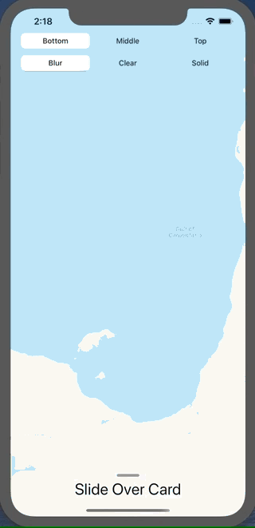
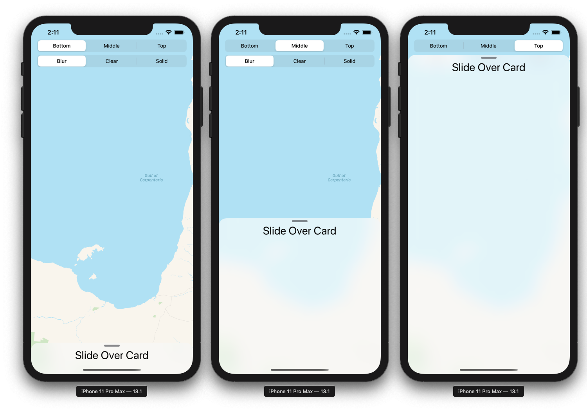
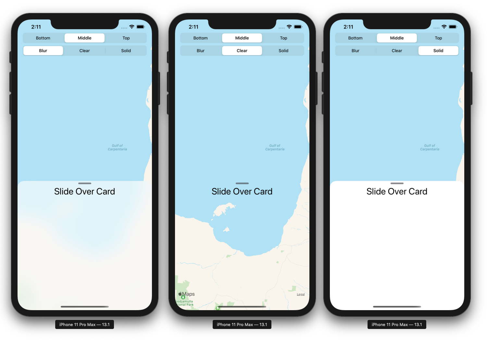

# Slide Over Card for SwiftUI



## Installation with Swift Package Manager

Swift Package Manager is integrated within Xcode 11:

1. File → Swift Packages → Add Package Dependency...
2. Paste the repository URL: https://github.com/moifort/swiftUI-slide-over-card.git

## Set Slide position



By default the slide is in `.middle` position. If you want to change it, set like:

```swift
SlideOverCard(.bottom) { // or .middle, .top
    VStack {
        Text("Slide Over Card").font(.title)
        Spacer()
    }
}
```

## Set Background Style



By default background is 'solid'. If you want to change it for blur or clear, set like:

```swift
SlideOverCard(backgroundStyle: .blur) { // or .clear or .solid
    VStack {
        Text("Slide Over Card").font(.title)
        Spacer()
    }
}
```

## Usage

```swift
import SwiftUI
import MapKit
import SlideOverCard // Add import

struct ContentView : View {
    @State private var position = CardPosition.top
    @State private var background = BackgroundStyle.blur
    
    var body: some View {
        ZStack(alignment: Alignment.top) {
            MapView()
            VStack {
                Picker(selection: self.$position, label: Text("Position")) {
                    Text("Bottom").tag(CardPosition.bottom)
                    Text("Middle").tag(CardPosition.middle)
                    Text("Top").tag(CardPosition.top)
                }.pickerStyle(SegmentedPickerStyle())
                Picker(selection: self.$background, label: Text("Background")) {
                    Text("Blur").tag(BackgroundStyle.blur)
                    Text("Clear").tag(BackgroundStyle.clear)
                    Text("Solid").tag(BackgroundStyle.solid)
                }.pickerStyle(SegmentedPickerStyle())
            }.padding().padding(.top, 25)
            SlideOverCard($position, backgroundStyle: $background) {
                VStack {
                    Text("Slide Over Card").font(.title)
                    Spacer()
                }
            }
        }
        .edgesIgnoringSafeArea(.vertical)
    }
}

struct MapView : UIViewRepresentable {
    
    func makeUIView(context: Context) -> MKMapView {
        MKMapView(frame: .zero)
    }
    
    func updateUIView(_ view: MKMapView, context: Context) {
        let coordinate = CLLocationCoordinate2D(latitude: -33.523065, longitude: 151.394551)
        let span = MKCoordinateSpan(latitudeDelta: 0.2, longitudeDelta: 0.2)
        let region = MKCoordinateRegion(center: coordinate, span: span)
        view.setRegion(region, animated: true)
    }
}

struct ContentView_Previews: PreviewProvider {
    static var previews: some View {
        ContentView()
    }
}

```

## Thanks

* To @mshafer for the [snippet](https://gist.github.com/mshafer/7e05d0a120810a9eb49d3589ce1f6f40)
* To @cyrilzakka for the [sample](https://github.com/cyrilzakka/SwiftUIModal)
